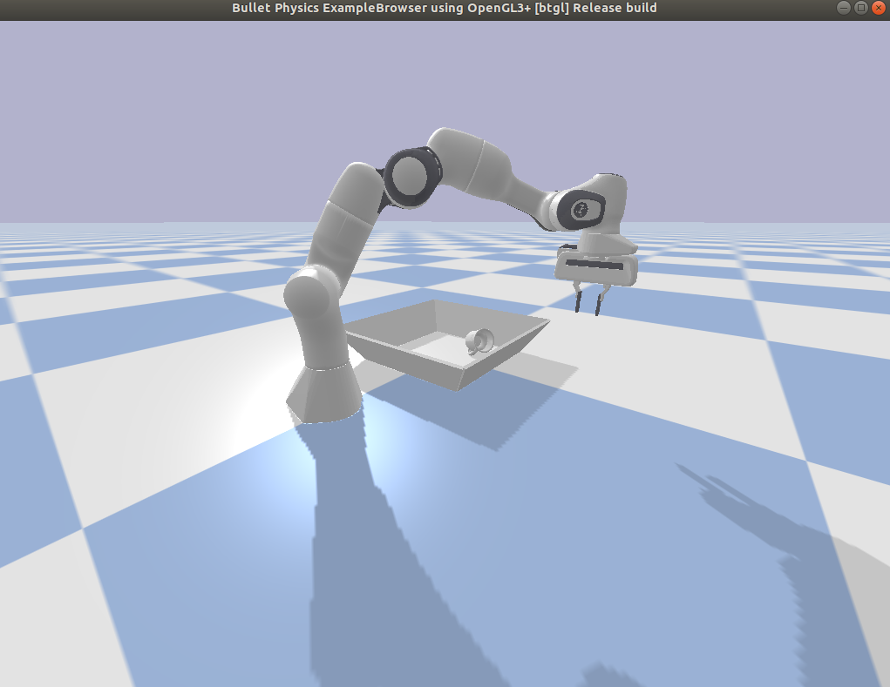
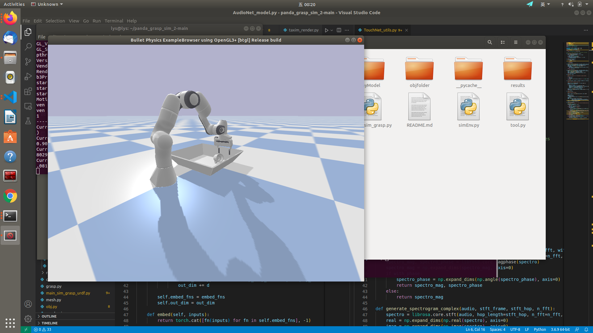
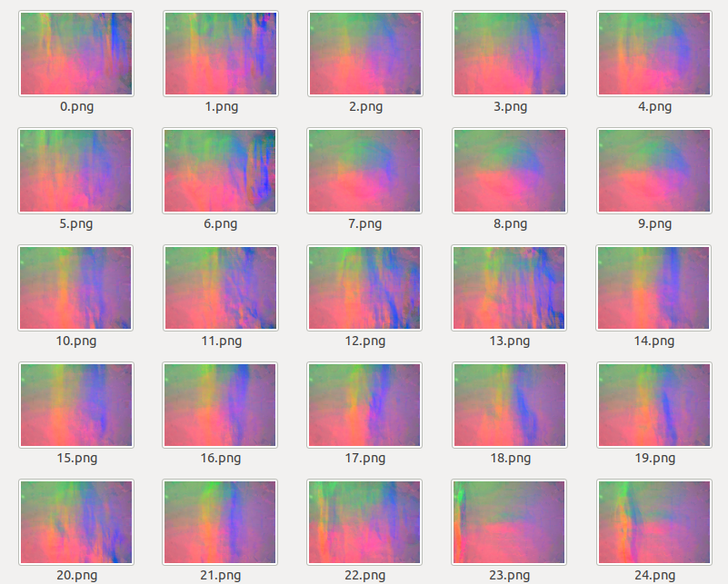
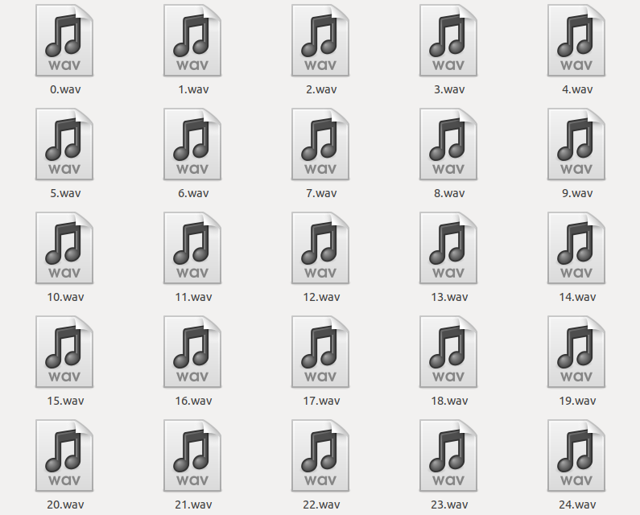

# Object folder 2.0 envrionment for Pybullet -- Real-time tactile Rendering of Object Folder

## Robot
Use panda as the platform to conduct grasp tasks.

## Object
1. The object is in ./egad_eval_set. Bottle with texture.

2. In order to obtain touch & audio sequences, need to train the touch & audio network for certain object. Please refer to 
https://github.com/rhgao/ObjectFolder.

3. Put the pre-trained network (.pth file) to ./demo folder.

## How the Touch Net Work

We detect the contact points between the robot arm and gripper. As for the contact point, we chose the geometry center of contact points to

render tactile iimages. And accumulate the normal and shear forces of those contact points to obatin forces.

## How to run it

1. Install Pybullet and the environment for Object folder 2.0.

2. run "python main_sim_grasp_urdf.py": It will show a grasping demo with tactile image rendered in real-time at the same time.

3. Two work mode in "panda_sim_grasp.py": One is grasping the object vertically (step_grasping) , the other is to rotation with relatively fixed 

position.(step_rotation)

3. run "python main_sim_grasp_test.py": This is a pythoy file to show how the predicted action sequences work o nthe robot arm. The trail file 

is in ./test. For each simulation step, read actions from the file and conduct it on the robot arm. (This is used to validate the results of MPC)

4. Touch, audio, grasping images and endpose&action sequences are available with "python main_sim_grasp_urdf.py". They coulde be found in ./

results. 

5. ./gif_gt/num2gif.py is a tool to generate .gif file from image sequences.

